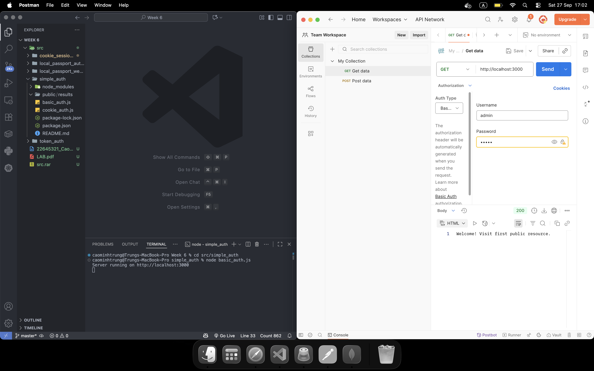
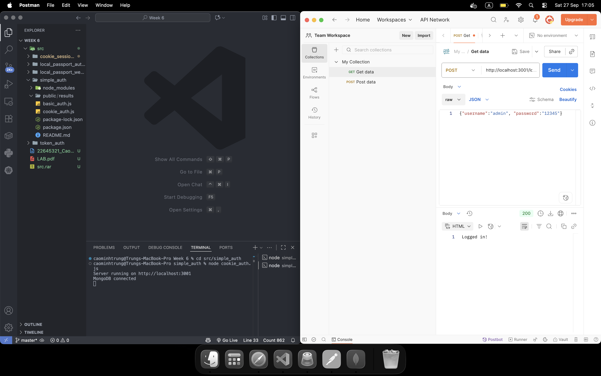
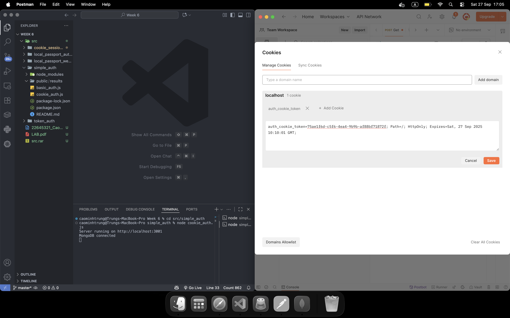
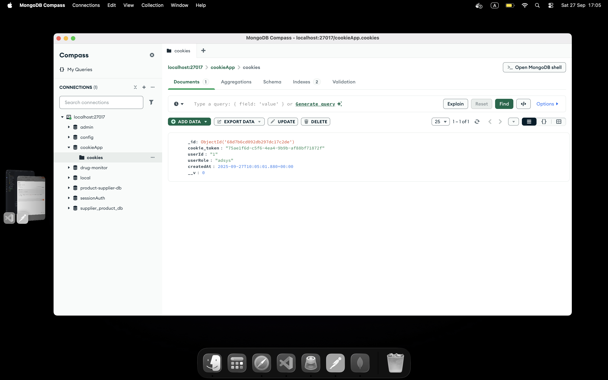

# Simple Auth

This project demonstrates basic authentication methods in Node.js and Express, including cookie-based and basic authentication.

## Features
- Basic authentication
- Cookie-based authentication

## Getting Started

1. Install dependencies:
   ```bash
   npm install
   ```
2. Run the desired authentication script:
   ```bash
   node basic_auth.js
   # or
   node cookie_auth.js
   ```
3. Access the app at `http://localhost:3000`

## Project Structure
- `basic_auth.js`: Basic authentication example
- `cookie_auth.js`: Cookie-based authentication example
- `package.json`: Project dependencies

## License

## Results

Below are screenshots from the `public/results` folder:

### Add Authorization


### Show Cookie 1


### Show Cookie 2


### Show Cookie in MongoDB


MIT
